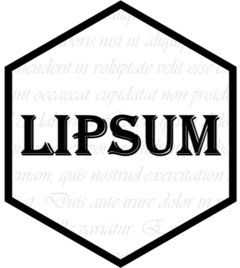

<!-- README.md is generated from README.Rmd. Please edit that file -->

# lipsum: access a variety of placeholder text APIs <a href="https://jack-davison.github.io/lipsum/"></a>

<!-- badges: start -->

[](https://github.com/jack-davison/lipsum/actions/workflows/R-CMD-check.yaml)
[](https://CRAN.R-project.org/package=lipsum)
<!-- badges: end -->

The goal of lipsum is to get easy access to several “Lorem Ipsum” web
APIs to simply generate customisable placeholder text. In the R world,
this will most likely commonly be used within RMarkdown/Quarto documents
and Shiny apps.

The `{lorem}` package also serves a similar purpose, but `{lipsum}`’s
interfacing with a variety of APIs may allow for more flexible
placeholder outputs. For example, the `lipsum_loripsum()` function gives
a lot of control of the kinds of features the placeholder text should
have (for example, lists, links, headers, and so on).

`{lipsum}` owes a lot to the
[awesome-ipsum](https://github.com/templeman/awesome-ipsum) list, and
uses its same categorisations:

- **Practical**, which are placeholder generators that are most useful
  for “professional” settings. These either generate text in Latin, or
  business-sounding text like newspaper articles.

- **Whimsical**, which are more playful generators which impersonate
  celebrities, list the names of dinosaurs, use profanity, and so on.
  These are perhaps more appropriate for personal projects!

## 💻 Installation

You can install the development version of `{lipsum}` like so:

``` r
#install.packages("pak")
pak::pak("jack-davison/lipsum")
```

## 🖱️ Example

Some examples of `{lipsum}` functions are shown below.

### 💼 Practical

The below code generates example lorem ipsum generated using the
[loripsum API](https://loripsum.net). This is the most useful,
customisable function in the package, and is probably most appropriate
for professional use.

``` r
ipsum <- lipsum::lipsum_loripsum(n = 3, decorate = TRUE, ol = TRUE, bq = TRUE)
```

In R, the output looks like this:

``` r
ipsum
#> [1] "<p>Lorem ipsum dolor sit amet, consectetur adipiscing elit. <mark>Prioris generis est docilitas, memoria;</mark> Estne, quaeso, inquam, sitienti in bibendo voluptas? <i>Ego vero isti, inquam, permitto.</i> Ut id aliis narrare gestiant? Duo Reges: constructio interrete. Odium autem et invidiam facile vitabis. </p>\n\n<blockquote cite='http://loripsum.net'>\n\tIam argumenti ratione conclusi caput esse faciunt ea, quae perspicua dicunt, deinde ordinem sequuntur, tum, quid verum sit in singulis, extrema conclusio est.\n</blockquote>\n\n\n<p>Quid sequatur, quid repugnet, vident. Minime vero, inquit ille, consentit. <b>Bork</b> Que Manilium, ab iisque M. Quae diligentissime contra Aristonem dicuntur a Chryippo. </p>\n\n<p><b>Habes, inquam, Cato, formam eorum, de quibus loquor, philosophorum.</b> Ex rebus enim timiditas, non ex vocabulis nascitur. Equidem etiam Epicurum, in physicis quidem, Democriteum puto. Habes, inquam, Cato, formam eorum, de quibus loquor, philosophorum. Sed erat aequius Triarium aliquid de dissensione nostra iudicare. Idemne, quod iucunde? Immo alio genere; Quo modo? </p>\n\n<ol>\n\t<li>Quae diligentissime contra Aristonem dicuntur a Chryippo.</li>\n\t<li>Si longus, levis dictata sunt.</li>\n\t<li>Suam denique cuique naturam esse ad vivendum ducem.</li>\n\t<li>Non ego tecum iam ita iocabor, ut isdem his de rebus, cum L.</li>\n\t<li>Satisne ergo pudori consulat, si quis sine teste libidini pareat?</li>\n</ol>\n\n\n"
```

Using GitHub markdown, this ends up looking like:

<p>
Lorem ipsum dolor sit amet, consectetur adipiscing elit. <mark>Prioris
generis est docilitas, memoria;</mark> Estne, quaeso, inquam, sitienti
in bibendo voluptas? <i>Ego vero isti, inquam, permitto.</i> Ut id aliis
narrare gestiant? Duo Reges: constructio interrete. Odium autem et
invidiam facile vitabis.
</p>
<blockquote cite="http://loripsum.net">
Iam argumenti ratione conclusi caput esse faciunt ea, quae perspicua
dicunt, deinde ordinem sequuntur, tum, quid verum sit in singulis,
extrema conclusio est.
</blockquote>
<p>
Quid sequatur, quid repugnet, vident. Minime vero, inquit ille,
consentit. <b>Bork</b> Que Manilium, ab iisque M. Quae diligentissime
contra Aristonem dicuntur a Chryippo.
</p>
<p>
<b>Habes, inquam, Cato, formam eorum, de quibus loquor,
philosophorum.</b> Ex rebus enim timiditas, non ex vocabulis nascitur.
Equidem etiam Epicurum, in physicis quidem, Democriteum puto. Habes,
inquam, Cato, formam eorum, de quibus loquor, philosophorum. Sed erat
aequius Triarium aliquid de dissensione nostra iudicare. Idemne, quod
iucunde? Immo alio genere; Quo modo?
</p>
<ol>
<li>
Quae diligentissime contra Aristonem dicuntur a Chryippo.
</li>
<li>
Si longus, levis dictata sunt.
</li>
<li>
Suam denique cuique naturam esse ad vivendum ducem.
</li>
<li>
Non ego tecum iam ita iocabor, ut isdem his de rebus, cum L.
</li>
<li>
Satisne ergo pudori consulat, si quis sine teste libidini pareat?
</li>
</ol>

### 🦕 Whimsical

As well as the practical lorem ipsum generators, there are a few
“whimsical” generators that are a bit more fun. For example,
`lipsum_dino()` generates a load of dinosaur names.

``` r
dinosaurs <- lipsum::lipsum_dino(n_paras = 3L, n_words = 10L)
```

Petrobrasaurus Drinker Kol Rapator Supersaurus Zigongosaurus Taohelong
Galtonia Bakesaurus Thecodontosaurus.

Moabosaurus Anabisetia Tastavinsaurus Ornithodesmus Pelorosaurus
Therosaurus Pawpawsaurus Succinodon Platypelta Lapampasaurus.

Antrodemus Frenguellisaurus Abrictosaurus Jiutaisaurus Azendohsaurus
Deinodon Agathaumas Atsinganosaurus Zuul Psittacosaurus.

On the other hand, `lipsum_actor()` generates some text as if it were
being spoken by a famous person or character from pop culture. The API
behind this function gives no control over which voice you are
receiving, so the one below is chosen completely at random!

``` r
actor <- lipsum::lipsum_actor(n = 3L)
```

Harrison Ford

Remember when you were six? You and your brother snuck into an empty
building through a basement window. You were going to play doctor. He
showed you his, but when it got to be your turn you chickened and ran;
you remember that? You ever tell anybody that? Your mother, Tyrell,
anybody? Remember the spider that lived outside your window? Orange
body, green legs. Watched her build a web all summer, then one day
there’s a big egg in it. The egg hatched… Implants. Those aren’t your
memories, they’re somebody else’s. They’re Tyrell’s niece’s.

Oh, Marcus. What are you trying to do, scare me? You sound like my
mother. We’ve known each other for a long time. I don’t believe in
magic, a lot of superstitious hocus pocus. I’m going after a find of
incredible historical significance, you’re talking about the boogie man.
Besides, you know what a cautious fellow I am.

This site also demonstrates one of the great dangers of archaeology; not
to life and limb, although that does sometimes take place. I’m talking
about folklore.
